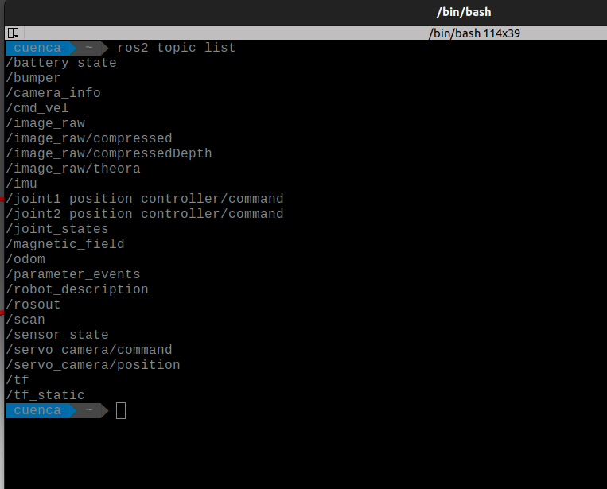
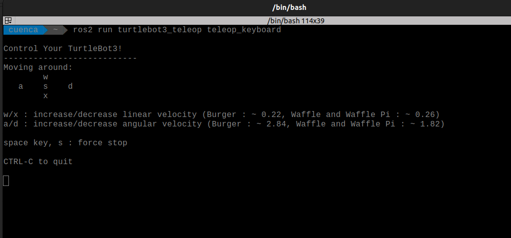
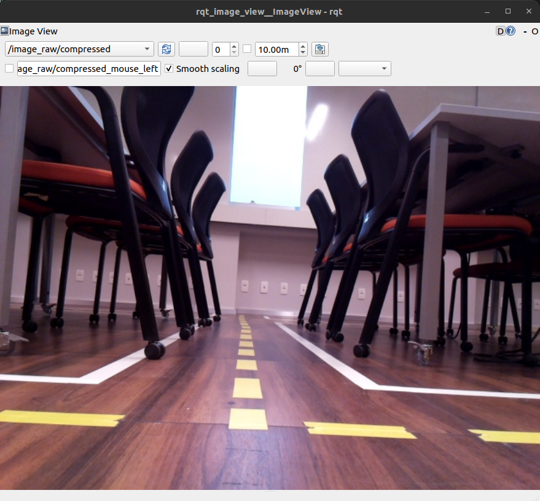

# Conectando no robô físico

Neste roteiro iremos controlar o robô físico pela primeira vez. Faremos as mesmas atividades que fizemos com o [robô simulado](../robo-simulado/index.md).

## Ligando o Robô

O primeiro passo para usarmos o Insperbot é ligar o robô. São três passos simples:

1. Primeiro você deve alocar a bateria, com cuidado, na parte inferior do robô;

2. Depois você deve conectar a batertia utilizando o conector amarelo;

3. Depois você deve ligar o robô utilizando o botão que fica no compartimento acima da bateria;

4. Por último você deve aguardar o robô ligar completamente. Quando o processo de iniciar estiver completo ou próximo de se completar, o seu nome e endereço IP aparecerão na telinha na parte de trás.

!!! warning 
    Em geral demora cerca de 2-3 minutos até o robô inicializar por completo. 


## Conectando na rede do robô

Cada robô cria uma rede Wifi própria que usaremos para enviar/receber dados diretamente. Isso permite muito mais velocidade na transmissão de dados e afeta principalmente os dados da câmera. Por outro lado,  ao se conectar no robô você ficará sem acesso à internet.

Agora que o Insperbot já está ligado, basta conectar na rede que ele liberou. Se atente ao número que está na parte de cima do robô, pois será o número da rede que você irá conectar. Por exmeplo, o Turtlebot 03 terá a rede: InsperBot03 e a senha da rede será **InsperBot03**. O mesmo acontecerá com todos os outros robôs. O nome exato da rede, considerando maiúsculas e minúculas, será a senha de rede.


Se tudo aconteceu como deveria, usando o comando:

```bash
ros2 topic list
```

Você verá a seguinte resposta:



## Teleoperando o robô

Para teleoperar o robô, você deve usar o seguinte comando:

```bash
ros2 run turtlebot3_teleop teleop_keyboard
```



como podemos ver na imagem acima, os comandos para movimentação do robô são w (para frente), x (para trás), a (para a esquerda), d (para a direita) e s (parar). quanto mais tempo ou vezes se pressiona a mesma tecla, maior a velocidade do movimento.

## Abrindo a câmera

Você pode visualizar a imagem da câmera com o mesmo comando usado no robô simulado:

```bash
ros2 run rqt_image_view rqt_image_view
```

Ao digitar este comando no terminal, teremos a seguinte janela aberta:



O ponto de atenção é o tópico da câmera, que no robô físico é: `/image_raw/compressed`
