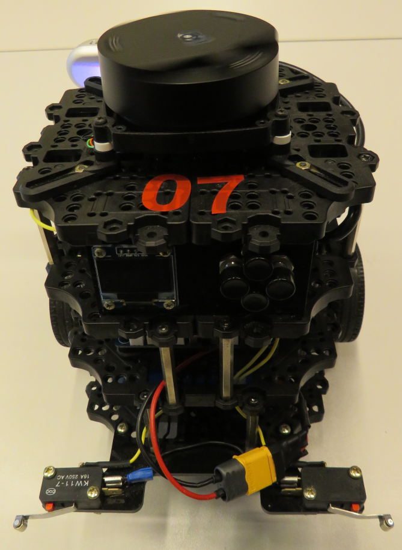
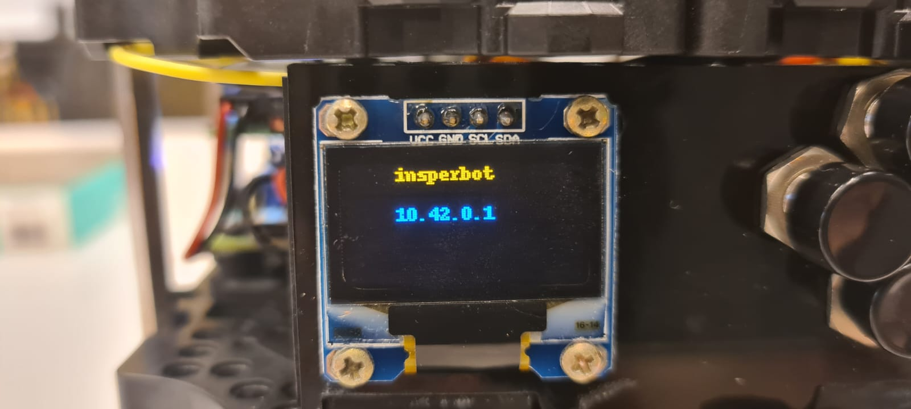
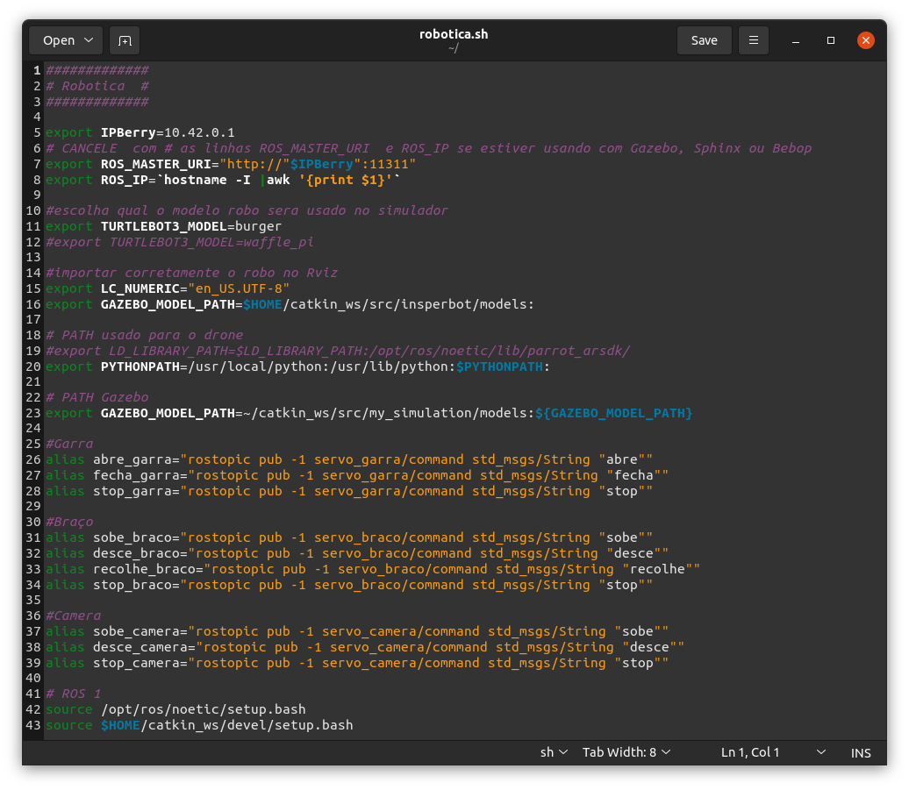
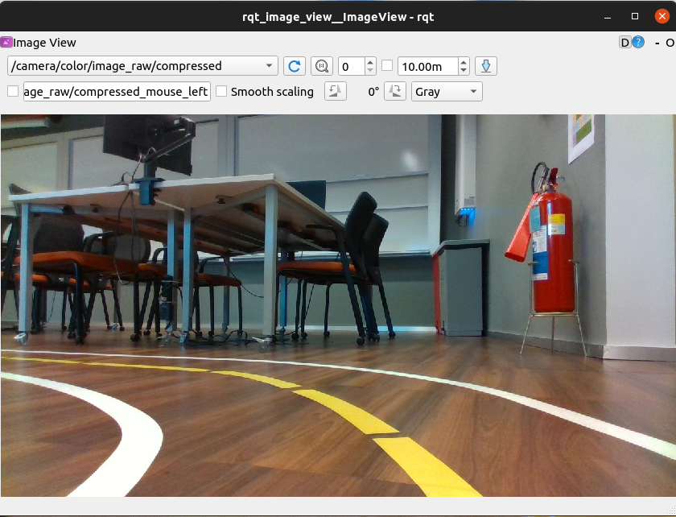

# Conectando no robô físico

Neste roteiro iremos controlar o robô físico pela primeira vez. Faremos as mesmas atividades que fizemos com o [robô simulado](../robo-simulado/index.md).

## Ligando o Robô

O primeiro passo para usarmos o Insperbot é ligar o robô. São três passos simples:

1. Primeiro você deve conectar a bateria utilizando o plug amarelo;
2. Depois você deve ligar o robô utilizando o botão que fica logo acima;
3. Por último você deve aguardar o robô fazer uma pequena música. Isto significa que ele inicializou todos os serviços corretamente e está mostrando o seu endereço IP na telinha.

!!! warning 
    Em geral demora cerca de 2-3 minutos até o robô inicializar por completo. 


## Conectando na rede do robô

Cada robô cria uma rede Wifi própria que usaremos para enviar/receber dados diretamente. Isso permite muito mais velocidade na transmissão de dados e afeta principalmente os dados da câmera. Por outro lado,  ao se conectar no robô você ficará sem acesso à internet.

Agora que o Insperbot já está ligado, basta conectar na rede que ele liberou. Se atente ao número que está na parte de cima do robô, pois será o número da rede que você irá conectar. A senha da rede é **turtlebot** .




## Configurando o arquivo robotica.sh

Para usar o robô físico, diferente do robô simulado precisamos que as linhas 5, 7 e 8 estejam ativas, ou seja sem o caractere de comentário, e a linha 5 tenha o IP do robô que aparece na telinha do robô. Veja baixo tanto a foto da telinha como deve ficar o arquivo robotica.sh:





Após estas alterações você deve salvar e fechar o gedit. Para efetivar a mudança, feche e abra novamente as janelas de terminais que está usando.

Se tudo aconteceu como deveria, usando o comando:

```bash
ros2 topic list
```

Você verá a seguinte resposta:


## Teleoperando o robô

Para teleoperar o robô, você deve usar o seguinte comando:

```bash
ros2 run turtlebot3_teleop teleop_keyboard
```


como podemos ver na imagem acima, os comandos para movimentação do robô são w (para frente), x (para trás), a (para a esquerda), d (para a direita) e s (parar). quanto mais tempo ou vezes se pressiona a mesma tecla, maior a velocidade do movimento.

## Abrindo a câmera

Você pode visualizar a imagem da câmera com o mesmo comando usado no robô simulado:

```bash
ros2 run rqt_image_view rqt_image_view
```

Ao digitar este comando no terminal, teremos a seguinte janela aberta:



O ponto de atenção é o tópico da câmera, que no robô físico é: `/camera/color/image_raw/compressed`
