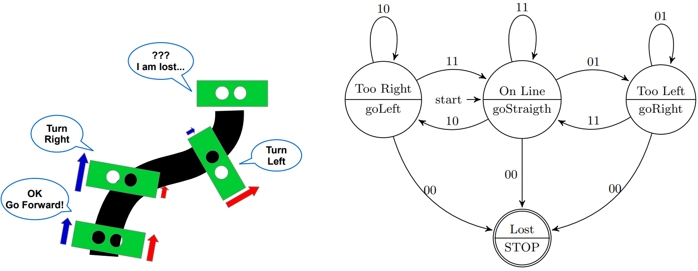

# Máquina de Estados em Robótica

Nesta atividade vamos aprender o conceito de máquina de estados e como implementá-la em um robô.

Imagine o robô seguidor de linha abaixo:



Uma forma de implementar o comportamento deste robô é utilizando uma máquina de estados. A máquina de estados é um modelo matemático que descreve o comportamento de um sistema. Ela é formada por um conjunto de estados e transições entre estes estados. Cada estado representa uma condição do sistema e cada transição representa uma mudança de estado.

No caso do robô seguidor de linha, podemos definir os seguintes estados:

* **Andar pra frente:** O robô anda pra frente rodando os dois motores em velocidade máxima.

* **Virar pra direita:** O robô vira para a direita rodando o motor esquerdo em velocidade máxima e o motor direito em velocidade mínima.

* **Virar pra esquerda:** O robô vira para a esquerda rodando o motor direito em velocidade máxima e o motor esquerdo em velocidade mínima.

* **Parar:** O robô para ambos os motores.

Agora podemos definir as transições entre os estados:

* **Andar pra frente:** O robô entra neste estado quando ambos os sensores estão detectando a linha.

* **Virar pra direita:** O robô entra neste estado quando apenas o sensor direito está detectando a linha.

* **Virar pra esquerda:** O robô entra neste estado quando apenas o sensor esquerdo está detectando a linha.

* **Parar:** O robô entra neste estado quando nenhum dos sensores está detectando a linha.

Em python, podemos implementar a máquina de estados definindo uma variável que armazena o estado atual do robô (string) e uma função para cada estado, que executa as ações necessárias para aquele estado. 

A função principal do robô deve executar a função do estado atual e verificar se o estado deve ser alterado. Isso poderia ser feito com um grande bloco de `if` e `elif`, mas uma forma mais elegante é utilizar um dicionário, onde a chave é o estado atual e o valor é uma função que deve ser executada.

Então, o a estrutura do código ficaria assim:

```python
    def __init__(self):
        ...

		self.robot_state = 'frente'
		self.state_machine = {
			'frente': self.andar_frente,
            'direita': self.virar_direita,
            'esquerda': self.virar_esquerda,
            'parar': self.parar
		}
    
    def frente(self):
        # Código para andar pra frente
    def direita(self):
        # Código para virar pra direita
    def esquerda(self):
        # Código para virar pra esquerda
    def parar(self):
        # Código para parar
    
    def control(self):
        self.state_machine[self.robot_state]()

        # Código para verificar se o estado deve ser alterado
```

No código acima, definimos o estado inicial como `frente` e criamos um dicionário chamado `state_machine` que associa cada estado a uma função. A função `control` executa a função do estado atual e o código para verificar se o estado deve ser alterado.

Outro ponto importante em máquinas de estados é a **definição do estado inicial**. No caso do robô seguidor de linha, o estado inicial é `frente`, pois se o robô `parar` ou `virar` ele pode não encontrar a linha.