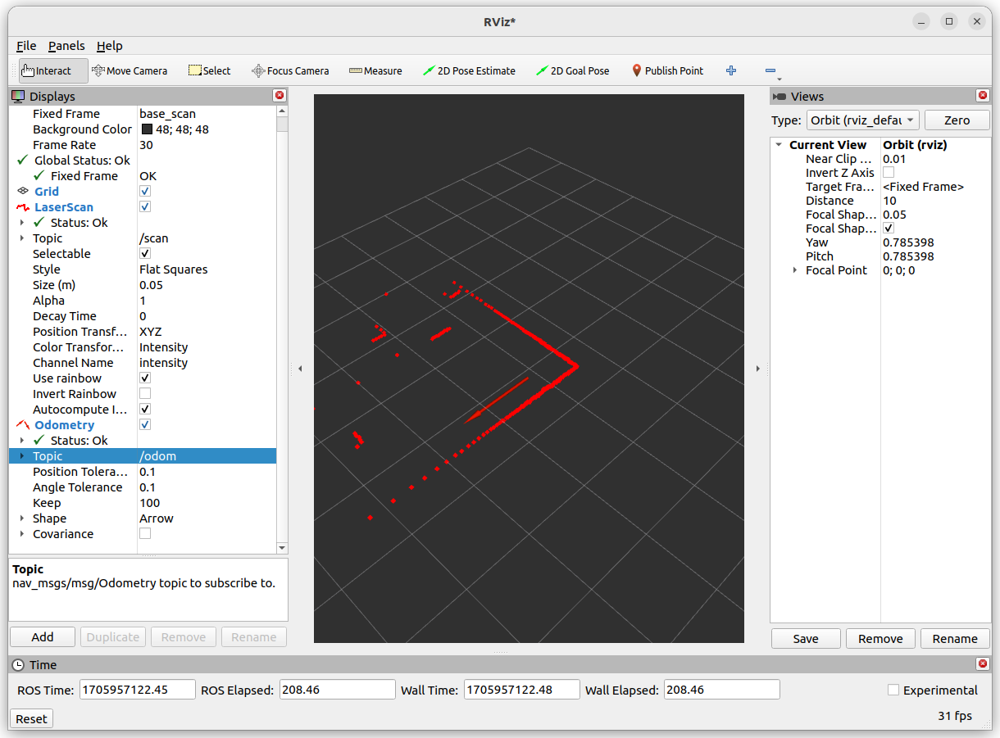

# Explorando as ferramentas de visualização da ROS

Nessa atividades, vamos ver como visualizar os dados dos sensores do robô.

## Visualizando o Tópico de Imagem
Para visualizar a imagem da câmera, vamos utilizar o `rqt_image_view`, que é uma ferramenta de visualização de imagens. Com o simulador e o teleop aberto, em um novo terminal, execute:

```bash
ros2 run rqt_image_view rqt_image_view
```

Quando o programa abrir, faça as seguites modificações:
* Atualize os tópicos clicando no botão `Refresh` (duas setas circulares).

* Selecione o tópico `/camera/image_raw`.


Para capturar o frame atual da image, clique no botão `Save as image`.


Na Unidade 2, vamos explorar mais a fundo como processar imagens, nesse momento, vamos apenas observar a imagem da câmera do robô.

## Visualizando o Tópico do Sensor de Distância

Na seção anterior estudamos o conteúdo do tópico `scan`. Agora vamos visualizar os dados do sensor de distância.

Vamos executar o `RViz`, que é uma ferramenta importante de monitoramento de dados de sensores e estado interno do robô, em um novo terminal, execute:

```bash
ros2 run rviz2 rviz2
```

Quando o programa abrir, faça as seguites modificações:

* Mude a celula `Fixed Frame` para `base_scan`

* Clique no botão `Add` e adicione `LaserScan`

* No `LaserScan` mude a celula `topic` para `/scan`

* E mude a celula `Size` para `0.05`

* Clique no botão `Add` e adicione `Odometry`

* No `Odometry` mude a celula `topic` para `/odom`

* No `Odometry` remova a seleção da celula `Covariance`

Você deve ter algo parecido com a imagem abaixo:



A sexta representa a `Pose` atual do robô, que é a posição e orientação do robô no espaço. Cada um dos circulos representa uma leitura do sensor de distância.

Agora pilote o robô utilizando o `teleop` e observe como os dados do sensor de distância e a pose do robô mudam.

